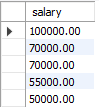

# Отсортируйте данные по полю заработная плата (salary) в порядке: убывания; возрастания для каждой группы
    SELECT *
    FROM staff
    ORDER BY post, salary DESC;

    SELECT *
    FROM staff
    ORDER BY post, salary;

# Выведите 5 максимальных заработных плат (saraly)

    SELECT salary
    FROM staff
    ORDER BY salary DESC
    LIMIT 5;

# Посчитайте суммарную зарплату (salary) по каждой специальности (роst)

    SELECT 
	    post AS "Должность",
	    SUM(salary) AS "Суммарная ЗП"
    FROM staff
    GROUP BY post;

# Найдите кол-во сотрудников с специальностью (post) «Рабочий» в возрасте от 24 до 49 лет включительно.

    SELECT COUNT(*) AS "Количество рабочих 24-49 лет"
    FROM staff
    WHERE post = "Рабочий" && age > 23 && age < 50;

# Найдите количество специальностей

    SELECT COUNT(DISTINCT post) AS "Количество специальностей"
    FROM staff;

# Выведите специальности, у которых средний возраст сотрудников меньше 35 лет

    SELECT post
    FROM staff
    GROUP BY post
    HAVING AVG(age) < 35;
